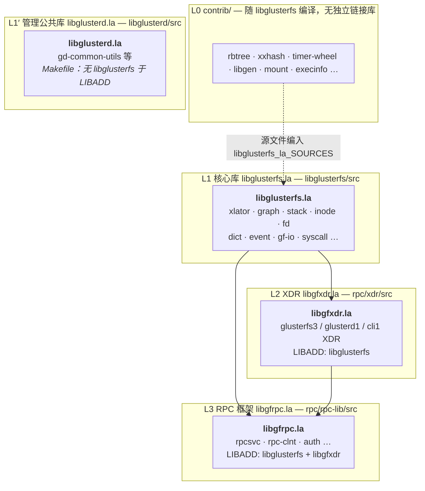
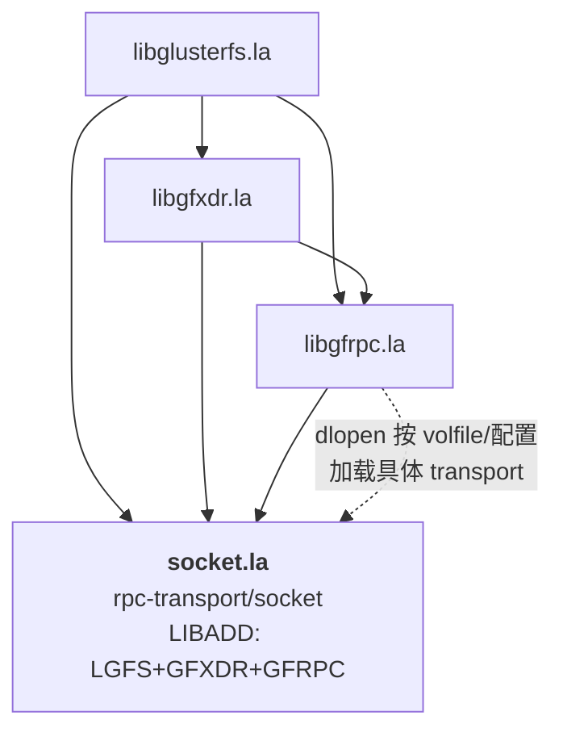
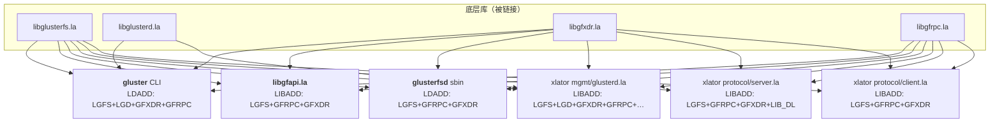
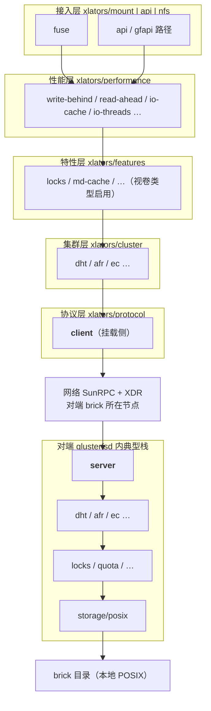
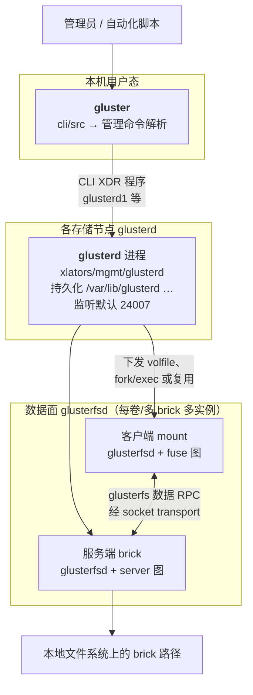

# GlusterFS 代码层次架构

本文描述 `glusterfs-10.5` 源码的**层次划分**、**链接依赖方向**与**运行时分层**，便于从“底层库 → RPC → 插件化 xlator → 进程入口”自上而下或反向阅读代码。与 [`glusterfs-10.5-software-architecture.md`](./glusterfs-10.5-software-architecture.md)（模块地图与数据流）互补。

---

## 1. 总览：两条正交视角

| 视角 | 回答的问题 |
|------|------------|
| **构建/链接层次** | 哪些 `.la` / 可执行文件依赖谁（由 `Makefile.am` 中 `LIBADD` / `LDADD` 决定） |
| **运行时/进程层次** | 哪些进程在跑、各自加载哪类 graph、控制面与数据面如何分离 |

二者不可混为一谈：例如 **CLI** 不加载 volume I/O 图，但会链接 **RPC 与 XDR** 以对话 **glusterd**。

---

## 2. 构建与链接层次（自底向上）

依赖方向为：**被链接者在下，链接者在上**（xlator 插件通过 `libglusterfs` 导出符号回调，不反向链接具体 xlator）。

下列图表拆成 **「库依赖链」**、**「传输插件」**、**「链接到库的进程/模块」**、**「单进程内 xlator 栈」**、**「控制面进程」** 五张，避免单图挤成一团；并在 §2.3 提供 **ASCII 总图**（等宽字符、信息密度高，便于对照 Makefile）。各 Mermaid 图内含有 `%%{init: …}%%` 以加大节点间距与字号——若你使用的 Markdown 预览器不支持该指令，可忽略，拓扑不变。

### 2.0 图一：核心 `.la` 编译依赖链（准确到 `LIBADD`）

`libglusterd.la` **不**依赖 `libglusterfs`（其 `Makefile.am` 中仅有 zlib/math/uuid），与 `libglusterfs` 同属可被上层同时链接的**并列基础**，勿画成上下级。



### 2.0b 图二：RPC 传输插件 `socket.la`（与 libgfrpc 的准确关系）

`rpc/rpc-transport/socket/src/Makefile.am`：`socket_la_LIBADD` = **libglusterfs + libgfxdr + libgfrpc**（另 `-lssl`）。  
运行时由 RPC 层按 `RPC_TRANSPORTDIR` 加载 **`-module`** 的 `socket.la`，不是 `libgfrpc.la` 的静态尾部。



### 2.0c 图三：可执行文件 / 典型 xlator 的 **LDADD / LIBADD**（谁链接谁）

仅列主要条目；`glusterd.la` 另有 `crypto`、`URCU`、`XML` 等（见 `xlators/mgmt/glusterd/src/Makefile.am`）。



### 2.0d 图四：单进程 **glusterfsd** 内 volume graph 逻辑分层（WIND 自上而下示意）

与 volfile 实际顺序可能略有出入；典型 **客户端挂载图** 为「近用户在上、近存储/网络出口在下」。



### 2.0e 图五：运行时进程与控制面 RPC（放大节点）



### 2.3 ASCII 总图（链接层次一览，便于全文搜索对照）

```
  ┌─────────────────────────────────────────────────────────────────────────────────────────┐
  │  L5 外围 / 脚本 / Python： events/ geo-replication/ tools/ — 不画入下列 .la 金字塔              │
  └─────────────────────────────────────────────────────────────────────────────────────────┘
                                                    │
         ┌──────────────────────────────────────────┼──────────────────────────────────────────┐
         │                                          │                                          │
         ▼                                          ▼                                          ▼
  ┌─────────────┐                           ┌─────────────┐                           ┌─────────────┐
  │ gluster     │                           │ glusterfsd  │                           │ libgfapi   │
  │ (sbin)      │                           │ (sbin)      │                           │ (.so)      │
  │ LDADD:      │                           │ LDADD:      │                           │ LIBADD:    │
  │  LGFS LGD   │                           │  LGFS       │                           │  LGFS      │
  │  GFXDR GFRPC│                           │  GFRPC GFXDR│                           │  GFRPC GFXDR│
  └──────┬──────┘                           └──────┬──────┘                           └──────┬──────┘
         │                                            │                                          │
         │    ┌───────────────────────────────────────┴──────────────────────────────────────┘
         │    │
         │    │     ┌──────────────────────────────────────────────────────────────────────────┐
         │    │     │  xlator 插件 *.la（示例 protocol/client）                                  │
         │    └──┬──│  LIBADD: libglusterfs.la + libgfrpc.la + libgfxdr.la                         │
         │       │  └──────────────────────────────────────────────────────────────────────────┘
         │       │
         │       │     ┌──────────────────────────────────────────────────────────────────────────┐
         │       └──┬──│  glusterd.la（mgmt）                                                      │
         │          │  │  LIBADD: libglusterfs + libglusterd + libgfxdr + libgfrpc + crypto + URCU… │
         │          │  └──────────────────────────────────────────────────────────────────────────┘
         │          │
         ▼          ▼
  ┌──────────────────────────────────────────────────────────────────────────────────────────────┐
  │  L3  libgfrpc.la  rpc/rpc-lib/src     LIBADD → libglusterfs.la + libgfxdr.la                  │
  └───────────────────────────────────────────────┬────────────────────────────────────────────┘
                                                    │
  ┌─────────────────────────────────────────────────┴────────────────────────────────────────────┐
  │  L2  libgfxdr.la  rpc/xdr/src       LIBADD → libglusterfs.la                                   │
  └───────────────────────────────────────────────┬────────────────────────────────────────────┘
                                                    │
  ┌─────────────────────────────────────────────────┴────────────────────────────────────────────┐
  │  L1  libglusterfs.la  libglusterfs/src  （contrib 源编入本库）                                   │
  └──────────────────────────────────────────────────────────────────────────────────────────────┘

  运行时插件（与上表并列的「另一三角形」）:
  ┌──────────────────────────────────────────────────────────────────────────────────────────────┐
  │  socket.la  rpc-transport/socket   LIBADD → libglusterfs + libgfxdr + libgfrpc ；由 GFRPC 加载 │
  └──────────────────────────────────────────────────────────────────────────────────────────────┘

  并列小库（不依赖 LGFS）:
  ┌──────────────────────────────────────────────────────────────────────────────────────────────┐
  │  libglusterd.la  libglusterd/src   LIBADD → zlib + math + uuid（无 libglusterfs）               │
  └──────────────────────────────────────────────────────────────────────────────────────────────┘
```

### 2.1 层次说明（与源码路径对应）

| 层级 | 产物 / 目录 | 依赖摘要 |
|------|-------------|----------|
| **L0** | `contrib/` | 源级内嵌，经 `libglusterfs_la_SOURCES` 编入 `libglusterfs`，**无独立 `.la`**。 |
| **L1** | `libglusterfs/src` → `libglusterfs.la` | 全树基石：xlator、`call_stack`、inode、dict、事件循环、graph 解析等。 |
| **L1′** | `libglusterd/src` → `libglusterd.la` | 管理侧公共代码；**`libglusterd_la_LIBADD` 不含 `libglusterfs`**（仅 zlib/math/uuid 等），与 LGFS **并列**被 `gluster` / `glusterd.la` 同时链接。 |
| **L2** | `rpc/xdr/src` → `libgfxdr.la` | 仅依赖 `libglusterfs`。 |
| **L3** | `rpc/rpc-lib/src` → `libgfrpc.la` | 依赖 `libglusterfs` + `libgfxdr`。 |
| **L3′** | `rpc/rpc-transport/socket` → `socket.la` | **插件**：`socket_la_LIBADD` = LGFS + GFXDR + GFRPC；运行时被 RPC 层加载，**不是** `libgfrpc.la` 静态链入。 |
| **L4** | `xlators/**`、`glusterfsd`、`api` | **client.la / server.la**：LGFS+GFRPC+GFXDR（server 另 `LIB_DL`）；**glusterd.la**：LGFS+LGD+GFXDR+GFRPC+crypto+URCU…；**glusterfsd**：LGFS+GFRPC+GFXDR。 |
| **L5** | `cli`、`heal`、`tools`… | **gluster**：LGFS+LGD+GFXDR+GFRPC。 |

### 2.2 与 Automake `SUBDIRS` 顺序的关系

根目录 `Makefile.am` 中 `SUBDIRS` 先 **libglusterfs**，再 **rpc**，再 **libglusterd**、**api**、**glusterfsd**、**xlators**…，与上述**先核心库、后 RPC、再依赖二者的程序与插件**的链接顺序一致，便于增量构建。

---

## 3. 单进程内：Volume Graph 的逻辑层次（数据面）

**纵向大图见 §2.0d**（含客户端栈、网络、对端 server→posix→磁盘）。本节为文字列表，便于检索。

在同一 **glusterfsd** 进程内，**volfile** 定义一棵有向树（多子节点即 fan-out）。习惯上从**靠近用户/网络入口**向**存储**描述为：

1. **接入层**：`xlators/mount/fuse` 或 `api` 相关、`xlators/nfs/server` 等。  
2. **策略/性能层**：`xlators/performance/*`。  
3. **特性层**：`xlators/features/*`（锁、配额、shard…）。  
4. **集群拓扑层**：`xlators/cluster/*`（dht、afr、ec）。  
5. **协议层**：`xlators/protocol/client` 或 `…/server`（与对端 RPC 对话）。  
6. **存储层**：`xlators/storage/posix`（及 `system/posix-acl` 等）。

**WIND 方向**通常从父到子走向存储；**UNWIND** 沿回调返回。具体父子顺序以生成的 volfile 为准，上述仅为常见叠放语义。

---

## 4. 运行时进程层次（控制面 vs 数据面）

**放大版 Mermaid 见 §2.0e**（多框、含 volfile / brick 路径说明）。下面用 **ASCII 进程关系** 再铺一层，宽度与 §2.3 一致，便于打印或全屏查看。

```
                    ┌─────────────────────────────────────────────────────────────┐
                    │                      管理员 / CI / Ansible                   │
                    └─────────────────────────────┬───────────────────────────────┘
                                                  │  shell
                                                  ▼
                    ┌─────────────────────────────────────────────────────────────┐
                    │  gluster  CLI（cli/src）                                      │
                    │  仅：解析 + libgfrpc 发往本机或对端 glusterd                   │
                    │  不加载 fuse / 不执行 volume FOP 栈                            │
                    └─────────────────────────────┬───────────────────────────────┘
                                                  │  glusterd1 / cli1 等管理 RPC (XDR)
                          ┌───────────────────────┼───────────────────────┐
                          ▼                       ▼                       ▼
                    ┌───────────┐           ┌───────────┐           ┌───────────┐
                    │ glusterd  │◄─────────►│ glusterd  │◄─────────►│ glusterd  │
                    │ 节点 A     │  peer RPC  │ 节点 B     │           │ 节点 N     │
                    └─────┬─────┘           └─────┬─────┘           └─────┬─────┘
                          │                       │                       │
                          │ volfile、systemd、    │                       │
                          │ 子进程编排             │                       │
                          ▼                       ▼                       ▼
                    ┌───────────┐           ┌───────────┐           ┌───────────┐
                    │glusterfsd │◄═════════►│glusterfsd │◄═════════►│glusterfsd │
                    │client 图  │ 数据面 RPC │server 图   │           │server 图   │
                    │(如 mount) │ (socket)  │(brick)     │           │(brick)     │
                    └───────────┘           └─────┬─────┘           └─────┬─────┘
                                                  │                       │
                                                  ▼                       ▼
                                            brick 目录               brick 目录
                                            (POSIX)                  (POSIX)
```

- **glusterd**：集群元数据、peer、volume 操作；代码集中在 `xlators/mgmt/glusterd/src`。  
- **glusterfsd**：执行 I/O 图；入口 `glusterfsd/src/glusterfsd.c`。  
- **CLI**：只负责解析与 RPC 调用，不实现 FOP 路径。

---

## 5. 外围组件在层次中的位置

| 组件 | 层次角色 |
|------|----------|
| **libgfapi** + **api** xlator | 应用链入的库（L4），之下仍为 LGFS + GFRPC + GFXDR。 |
| **heal** | 运维/自愈工具，依赖已安装的库与脚本环境，不进入核心链接金字塔顶端。 |
| **geo-replication** | 同步守护进程与脚本，与主 I/O 栈并行。 |
| **events** | Python 服务，对接集群事件，独立于 C 核心链接层次。 |
| **tests** | 验证整栈行为，非运行时分层的一部分。 |

---

## 6. 阅读代码时的推荐路径

1. **L1**：`glusterfs/xlator.h`、`stack.h`、`graph.c` 概念。  
2. **L2–L3**：`rpc-clnt.h`、`rpcsvc.h`、与 `xlators/protocol/client` 中发送路径。  
3. **L4 单条 FOP**：从 fuse 或 server 的某个 `fops` 成员一直跟到 `posix`。  
4. **控制面**：`cli/src/cli-cmd-*.c` → glusterd `glusterd-handler.c` / `glusterd-op-sm.c`。

---

## 7. 相关文档

- [`glusterfs-10.5-software-architecture.md`](./glusterfs-10.5-software-architecture.md)：子系统目录与数据流总览。  
- [`glusterfs-cluster-setup.md`](./glusterfs-cluster-setup.md)：信任池与 glusterd 交互的运维与源码对应。

---

*层次关系依据 `glusterfs-10.5` 内 `Makefile.am` 的 `LIBADD`/`LDADD` 与目录职责归纳；若本地开启/关闭可选组件（如 NFS、server），具体链接表以生成的 Makefile 为准。*
