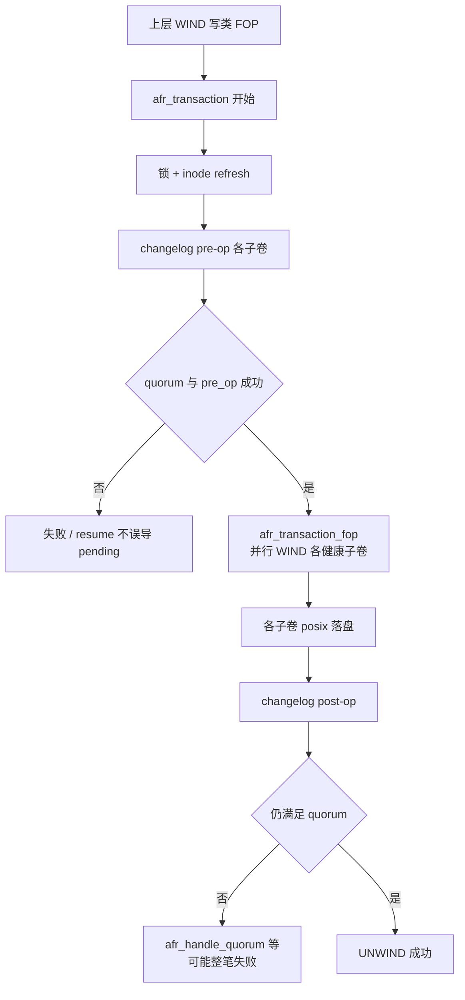
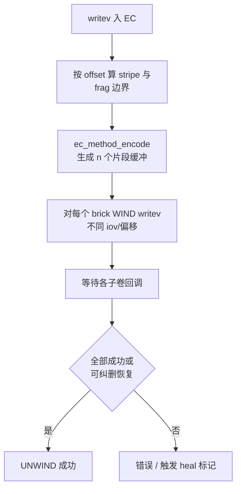

# GlusterFS 副本（AFR）与纠删码（EC）实现分析

本文基于 **`glusterfs-10.5/xlators/cluster/afr`** 与 **`glusterfs-10.5/xlators/cluster/ec`** 源码，说明**副本卷**与 **dispersed（纠删码）卷**在 Gluster 中的实现思路、关键数据结构与典型调用链。可与 [`glusterfs模块流程图.md`](./glusterfs模块流程图.md) 中 §14–§16、§24 对照阅读。

---

## 1. 问题定义：两种冗余模型

| 维度 | 副本（Replicate / AFR） | 纠删码（EC / Dispersed） |
|------|-------------------------|---------------------------|
| **语义** | 每个 brick 存**同一份**用户数据（整文件镜像） | 用户数据被切成 **stripe**，经线性编码拆成 **fragment** 分布到 n 个 brick，容忍 **m 个** brick 失效（冗余度可配置） |
| **子卷** | 多个子 xlator 指向各副本 brick，AFR 在它们之上 fan-out/fan-in | 多个子 brick，EC 按条带与掩码向各子卷发不同片段 |
| **典型配置** | `replica 3` + 可选 arbiter | `disperse`：`redundancy` = m，`fragments` = k = n−m |
| **源码目录** | `xlators/cluster/afr/` | `xlators/cluster/ec/` |

---

## 2. 副本：`cluster/afr`（Automatic File Replication）

### 2.1 功能职责

- 对 **data / metadata / entry** 三类变更维护跨副本一致性。  
- **写路径**：在多数副本上完成相同 FOP；用 **changelog（扩展属性）** 记录“谁落后、待自愈”。  
- **读路径**：在 `readable` 副本间选择或合并（`afr-read-txn.c` 等）。  
- **仲裁（quorum）**：可配置 `quorum-count` 或自动策略，避免网络分区下双主写导致 **split-brain**（`afr_has_quorum`、`afr_handle_quorum`）。  
- **自愈**：`afr-self-heal*`、`afr-self-heald` 与 **shd** 协同，按 pending xattr 拉齐副本。  
- **仲裁 brick（arbiter）**：第三副本仅存元数据/仲裁信息，降低空间占用（`ARBITER_BRICK_INDEX` 等）。

### 2.2 事务模型（Transaction）

核心类型见 `afr-transaction.h` / `afr-transaction.c`：**`afr_transaction`** 将一次用户 FOP 包装为多阶段子操作：

1. **锁与准备**（视 FOP：`afr_lock` 等）。  
2. **changelog pre-op**：在各子卷上标记“事务进行中”，计算 **pre_op_sources** 等，保证后续写入有明确来源集。  
3. **数据 FOP**：**`afr_transaction_fop`** 对**未失败且通过 pre-op 的子卷**执行 `wind`（并行 WIND 到多个 child）。  
4. **changelog post-op**：根据成功集合更新/清除 pending；若未满足 quorum，则整笔事务失败并进入 **dirty** 等状态，避免错误 pending 加剧 split-brain（`afr_handle_quorum` 注释中有详细场景说明）。

写事务是否继续的判定示例（需 **changelog quorum** 且数据事务需 **writable subvol**）：

```292:332:glusterfs-10.5/xlators/cluster/afr/src/afr-transaction.c
int
afr_transaction_fop(call_frame_t *frame, xlator_t *this)
{
    afr_local_t *local = NULL;
    afr_private_t *priv = NULL;
    int call_count = -1;
    unsigned char *failed_subvols = NULL;
    int i = 0;

    local = frame->local;
    priv = this->private;

    failed_subvols = local->transaction.failed_subvols;
    call_count = priv->child_count -
                 AFR_COUNT(failed_subvols, priv->child_count);
    /* Fail if pre-op did not succeed on quorum no. of bricks. */
    if (!afr_changelog_has_quorum(local, this) || !call_count) {
        local->op_ret = -1;
        /* local->op_errno is already captured in changelog cbk. */
        afr_transaction_resume(frame, this);
        return 0;
    }

    /* Fail if at least one writeable brick isn't up.*/
    if (local->transaction.type == AFR_DATA_TRANSACTION &&
        !afr_is_write_subvol_valid(frame, this)) {
        local->op_ret = -1;
        local->op_errno = EIO;
        afr_transaction_resume(frame, this);
        return 0;
    }

    local->call_count = call_count;
    for (i = 0; i < priv->child_count; i++) {
        if (local->transaction.pre_op[i] && !failed_subvols[i]) {
            local->transaction.wind(frame, this, i);

            if (!--call_count)
                break;
        }
    }

    return 0;
}
```

### 2.3 Changelog 与 `AFR_NUM_CHANGE_LOGS`

`afr.h` 中 **`AFR_NUM_CHANGE_LOGS`** 为 **3**（data + metadata + entry），对应不同 FOP 在 xattr 上记录的 pending 域，自愈时按域扫描。

### 2.4 可读 / 可写子卷选择

**`afr_readables_fill`** 等根据各子卷 xattr、事件代数 **event_generation** 等判定 **data_readable / metadata_readable**；**`afr_write_subvol_set`** 将 **datamap / metadatamap** 与 event 打包进 `inode_ctx->write_subvol`，保证并发写与读修复时有一致的“主副本”视图：

```7578:7585:glusterfs-10.5/xlators/cluster/afr/src/afr-common.c
    val = ((uint64_t)metadatamap) | (((uint64_t)datamap) << 16) |
          (((uint64_t)event) << 32);

    LOCK(&local->inode->lock);
    {
        if (local->inode_ctx->write_subvol == 0 &&
            local->transaction.type == AFR_DATA_TRANSACTION) {
            local->inode_ctx->write_subvol = val;
        }
    }
```

### 2.5 源码文件导航（AFR）

| 文件模式 | 作用 |
|----------|------|
| `afr-transaction.c` | 事务、changelog、quorum、fop 下发 |
| `afr-inode-read.c` / `afr-inode-write.c` | inode 级读写与刷新 |
| `afr-dir-read.c` / `afr-dir-write.c` | 目录项复制与一致性 |
| `afr-read-txn.c` | 读事务与多子卷聚合 |
| `afr-self-heal*.c` | 自愈扫描与修复 |
| `afr-common.c` | 公共工具、inode_ctx、锁与错误处理 |

### 2.6 AFR 写路径流程图（逻辑）



---

## 3. 纠删码：`cluster/ec`（Erasure Code / Dispersed）

### 3.1 功能职责

- 将逻辑连续的用户数据按 **stripe** 切分；每个 stripe 再切成 **k 个 fragment**（数据块），经 **GF(2^8)** 上线性编码生成 **n 个** brick 上的片（含 **m 个**冗余片），丢失不超过 **m** 个 brick 时可 **decode** 恢复。  
- **`ec_t`**（`ec-types.h`）保存 **`nodes`（n）**、**`fragments`（k）**、**`redundancy`（m）**、**`stripe_size`**、各 brick up 掩码、**`ec_matrix_list_t matrix`** 等。  
- **读**：根据可用 brick 掩码选择矩阵行，**`ec_method_decode`** 合并片段。  
- **写**：**`ec_method_encode`** 生成各 brick 的片并分别 WIND；支持条带缓存、并行写等优化（`ec-inode-write.c` 等）。  
- **自愈**：`ec_heal*`、`ec_self_heald`、`subvol_healer` 线程池；与 **EC_HEAL_*** 状态机配合。

### 3.2 参数关系（初始化）

`ec_parse_options` / `ec_prepare_childs` 中：

- **`ec->nodes`** = 子 xlator 个数 **n**。  
- **`redundancy`** = **m**（卷选项，须满足 `1 <= m < k` 且 `k = n - m` 等校验）。  
- **`ec->fragments`** = **k** = **n − m**（数据片个数）。  
- **`fragment_size`**：单 brick 上单片大小，与 **`EC_METHOD_CHUNK_SIZE`** 对齐；**`stripe_size`** = **`fragment_size * k`**（单条带内用户数据最大量）。

```53:77:glusterfs-10.5/xlators/cluster/ec/src/ec.c
    GF_OPTION_INIT("redundancy", ec->redundancy, int32, out);
    ec->fragments = ec->nodes - ec->redundancy;
    if ((ec->redundancy < 1) || (ec->redundancy >= ec->fragments) ||
        (ec->fragments > EC_MAX_FRAGMENTS)) {
        gf_msg(this->name, GF_LOG_ERROR, EINVAL, EC_MSG_INVALID_REDUNDANCY,
               "Invalid redundancy (must be between "
               "1 and %d)",
               (ec->nodes - 1) / 2);

        goto out;
    }

    ec->bits_for_nodes = 1;
    mask = 2;
    while (ec->nodes > mask) {
        ec->bits_for_nodes++;
        mask <<= 1;
    }
    ec->node_mask = (1ULL << ec->nodes) - 1ULL;
    ec->fragment_size = EC_METHOD_CHUNK_SIZE;
    ec->stripe_size = ec->fragment_size * ec->fragments;
```

### 3.3 编码与解码：`ec-method.c`

- **`ec_method_encode`**：按 **`list->stripe`** 步进用户缓冲区，对矩阵每一行调用 **`linear`** 型 **GF 线性组合**，输出写入各 **out[i]** 对应 brick 的片段。  
- **`ec_method_decode`**：根据当前可用 brick 的 **mask** 与 **rows** 选取 **`ec_method_matrix_get`** 得到的解码矩阵，按 **`EC_METHOD_CHUNK_SIZE`** 步进，用 **interleaved** 函数把多个 **in[]** 片段还原到用户 **out**。

```393:432:glusterfs-10.5/xlators/cluster/ec/src/ec-method.c
void
ec_method_encode(ec_matrix_list_t *list, uint64_t size, void *in, void **out)
{
    ec_matrix_t *matrix;
    uint64_t pos;
    uint32_t i;

    matrix = list->encode;
    for (pos = 0; pos < size; pos += list->stripe) {
        for (i = 0; i < matrix->rows; i++) {
            matrix->row_data[i].func.linear(
                out[i], in, pos, matrix->row_data[i].values, list->columns);
            out[i] += EC_METHOD_CHUNK_SIZE;
        }
    }
}

int32_t
ec_method_decode(ec_matrix_list_t *list, uint64_t size, uintptr_t mask,
                 uint32_t *rows, void **in, void *out)
{
    ec_matrix_t *matrix;
    uint64_t pos;
    uint32_t i;

    matrix = ec_method_matrix_get(list, mask, rows);
    if (EC_IS_ERR(matrix)) {
        return EC_GET_ERR(matrix);
    }
    for (pos = 0; pos < size; pos += EC_METHOD_CHUNK_SIZE) {
        for (i = 0; i < matrix->rows; i++) {
            matrix->row_data[i].func.interleaved(
                out, in, pos, matrix->row_data[i].values, list->columns);
            out += EC_METHOD_CHUNK_SIZE;
        }
    }

    ec_method_matrix_put(list, matrix);

    return 0;
}
```

底层有限域与 SIMD 路径见 **`ec-galois.h`**、**`ec-code*.c`**（C / Intel / AVX 等），**`ec_method_init`** 建立 **`ec_matrix_list_t`** 与 LRU 缓存的矩阵对象。

### 3.4 FOP 层：`ec_fop_data_t` 与多子卷 WIND

EC 将每个高层 FOP 扩展为 **`ec_fop_data_t`**（见 `ec-types.h` / `ec-common.c`）：记录 **winds 到各子卷的 mask**、回调计数、条带范围 **frag_range** 等；写路径上 **`ec-inode-write.c`** 负责条带边界、尾部合并 **`ec_writev_merge_tail`**、条带缓存 **`ec_add_stripe_in_cache`** 等与副本完全不同的 **“分片写”** 逻辑。

### 3.5 源码文件导航（EC）

| 文件 / 模块 | 作用 |
|-------------|------|
| `ec.c` / `ec-common.c` | 初始化、notify、FOP 调度公共逻辑 |
| `ec-method.c` / `ec-galois.c` | 矩阵编码解码、GF 运算 |
| `ec-code*.c` | 按 CPU 能力选择具体乘加实现 |
| `ec-inode-read.c` / `ec-inode-write.c` | 条带读写的拆分与合并 |
| `ec-heal*.c` / `ec-heald.c` | 纠删码自愈与后台线程 |
| `ec-fops.h` / `ec-combine.c` | FOP 表与应答合并 |

### 3.6 EC 写路径流程图（逻辑）



---

## 4. AFR 与 EC 的对比小结

| 项目 | AFR | EC |
|------|-----|-----|
| **空间效率** | 约 **1/replica** 用户数据 | 约 **k/n**（优于多副本） |
| **单 brick 内容** | 完整文件镜像 | 仅条带片段 + 冗余片 |
| **一致性手段** | changelog xattr + 事务 + quorum | 版本/掩码 + 矩阵可逆条件 + heal |
| **读延迟** | 选一副本即可（策略可调） | 常需聚合 k 个存活 fragment |
| **实现复杂度** | 事务与 split-brain 规则多 | 数学与条带边界、并行写复杂 |

---

## 5. 相关文档与上游资料

- [`glusterfs模块详解与实现原理.md`](./glusterfs模块详解与实现原理.md) — §3.5 / §3.6 概括  
- [`glusterfs模块流程图.md`](./glusterfs模块流程图.md) — AFR/EC/端到端图  
- 上游：`glusterfs-10.5/doc/developer-guide/afr.md` 等  

---

*分析基于 GlusterFS 10.5 源码树；卷参数与 CLI 语法以 [Gluster Docs](https://docs.gluster.org) 为准。*
