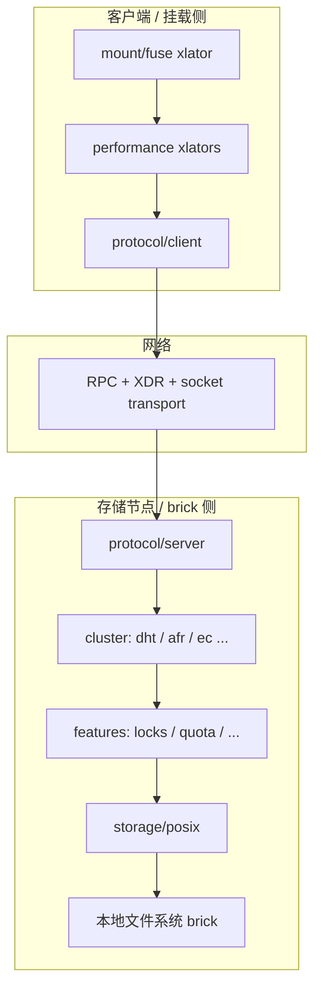

# GlusterFS 10.5 软件架构分析

本文档基于源码树 `glusterfs-10.5/` 的目录布局、Autotools 配置与核心抽象，对 **GlusterFS 10.5** 进行软件架构层面的归纳，便于阅读代码、定位模块与扩展 Translator。

---

## 1. 文档范围与源码位置

| 项目 | 说明 |
|------|------|
| 分析对象 | 本仓库内 `glusterfs-10.5/` 目录（与上游 GlusterFS 10.x 系列结构一致） |
| 构建系统 | GNU Autotools：`configure.ac` + 各子目录 `Makefile.am` |
| 顶层 `SUBDIRS`（摘自根 `Makefile.am`） | `libglusterfs` → `rpc` → `libglusterd` → `api` → `glusterfsd` → `xlators` → … → `doc` / `extras` / `cli` / `heal` / `geo-replication`（条件） / `tools` / `events` 等 |

官方用户文档与运维指南见 [Gluster Docs](https://docs.gluster.org)；本文侧重**源码模块划分与运行时模型**。

---

## 2. 高层架构概览

GlusterFS 是**用户态**的分布式文件系统：通过 **Translator（xlator）** 组成有向图（**volume graph**），在 **FUSE** 或 **NFS** 等入口与 **POSIX 存储后端（brick）** 之间传递文件系统操作（FOP, file operation）。

核心设计要点：

- **模块化堆栈**：每个 xlator 实现一组 `fops`（如 `readv`、`writev`、`lookup`），请求沿父子链 **WIND** 下发，响应沿 **UNWIND** 回调返回。
- **异步调用栈**：`call_stack_t` / `call_frame_t`（见 `libglusterfs/src/glusterfs/stack.h`）模拟异步调用链，配合线程池与事件循环完成高并发。
- **控制面与数据面分离**：集群配置、卷管理由 **glusterd**（管理 xlator）与 **CLI** 完成；实际 I/O 由 **glusterfsd** 进程及其 graph 执行。
- **进程间通信**：brick 与 client 侧通过 **SunRPC + XDR** 编解码（`rpc/`），底层传输多为 **socket**（`rpc/rpc-transport/socket`）。

---

## 3. 子系统与目录映射

### 3.1 `libglusterfs` — 运行时内核

路径：`libglusterfs/src/`

承担“Gluster 在用户态的内核”职责，主要包括：

| 能力 | 代表文件/模块 |
|------|----------------|
| Translator 与图 | `xlator.c`、`graph.c`、`graph.y` / `graph.l`（volfile 解析） |
| 调用栈与异步 | `stack.h`、`call-stub.c`、`syncop.c` |
| inode / fd / dentry | `inode.c`、`fd.c`、`gf-dirent.c` |
| 字典、内存池、日志 | `dict.c`、`*mem*`、`logging` 相关 |
| 事件循环与 I/O | `event*.c`、`gf-io*.c`（含 io_uring 等后端） |
| 客户端附着 | `client_t.c` |

**xlator** 类型定义见 `glusterfs/xlator.h`：`xlator_t` 持有 `fops`、`cbks`、`private`、父子链表、`options` 等；`xlator_api_t` 描述模块导出符号（`init`/`fini`/`reconfigure` 等）。

### 3.2 `xlators/` — 可插拔 Translator 插件

按功能分类（与 `configure.ac` 中 `AC_CONFIG_FILES` 及子目录一致）：

| 分类 | 路径前缀 | 职责摘要 |
|------|-----------|----------|
| **mount** | `xlators/mount/fuse` | 对接 Linux FUSE，用户态挂载入口 |
| **protocol** | `xlators/protocol/client`、`.../server` | RPC 客户端/服务端 glue；`auth/*` 鉴权 |
| **cluster** | `xlators/cluster/dht`、`afr`、`ec` | 分布、副本、纠删码等聚合逻辑 |
| **storage** | `xlators/storage/posix` | 将 FOP 落到本地目录（brick） |
| **features** | `xlators/features/*` | 锁、配额、marker、shard、barrier、changelog、bit-rot、leases、cloudsync 等横切能力 |
| **performance** | `xlators/performance/*` | write-behind、read-ahead、io-cache、io-threads、md-cache 等 |
| **debug** | `xlators/debug/*` | trace、io-stats、error-gen 等调试与统计 |
| **system** | `xlators/system/posix-acl` | ACL 等系统层行为 |
| **nfs** | `xlators/nfs/server` | 内置 NFS 服务路径（与 gfapi/其他访问方式并存） |
| **mgmt** | `xlators/mgmt/glusterd` | **glusterd** 管理进程逻辑与 RPC 服务 |
| **meta** | `xlators/meta` | 元数据/辅助类 translator |
| **playground** | `xlators/playground/template` | 新 translator 模板示例 |

各 xlator 通常编译为**共享库**（`.so`），由 volfile 指定类型名并在运行时 `dlopen` 加载。

### 3.3 `rpc/` — 远程过程调用基础设施

| 子目录 | 作用 |
|--------|------|
| `rpc-lib` | RPC 框架、连接、程序注册、客户端/服务端状态机 |
| `rpc-transport/socket` | 基于套接字的传输实现 |
| `xdr` | XDR 编解码与协议数据结构（如 `glusterfs3` 相关） |

`rpc-clnt.h` 等头文件将 **RPC 事件** 与 **call_frame** 结合，使协议层能挂接异步回调。

### 3.4 `glusterfsd/` — 存储/客户端守护进程主体

`glusterfsd/src/glusterfsd.c` 为进程入口之一：解析命令行（`argp`）、加载 volfile、初始化 `glusterfs_ctx_t`、构建并激活 **graph**，处理信号与生命周期。实际图结构由 volfile / glusterd 下发决定，区分 **客户端挂载** 与 **brick 服务端** 进程实例。

### 3.5 `libglusterd/` — glusterd 支持库

供管理面复用的数据结构、RPC、存储抽象等（与 `xlators/mgmt/glusterd` 协同）。

### 3.6 `cli/` — 命令行管理工具

用户常用的 `gluster` CLI：将命令转换为对 glusterd 的管理 RPC / 本地操作。

### 3.7 `api/` — libgfapi

对外 C API（`gfapi`），使应用可直接以 Gluster 卷为后端做 I/O，而不必经过内核 FUSE 挂载；含 `pkg-config`（根目录 `glusterfs-api.pc.in`）。

### 3.8 `heal/` — 自愈相关组件

与 AFR/EC 等一致性修复、自愈流程配合的独立工具/守护逻辑（具体入口见 `heal/src`）。

### 3.9 `geo-replication/`

跨集群异步复制：`syncdaemon`、配置模板与脚本；与主数据路径正交，依赖 changelog 等特性。

### 3.10 `events/` — 事件通知

Python 实现的 `glustereventsd` 与事件处理插件，用于将集群事件暴露给外部系统（见 `events/src/*.py`）。

### 3.11 `tools/`、`extras/`

运维脚本、基准测试、systemd/unit、hook、ganesha 集成等**非核心 I/O 路径**资源。

### 3.12 `contrib/`

第三方或内嵌依赖：FUSE 头文件/工具、用户态 RCU、xxhash、timer-wheel 等，保证多 OS 可移植构建。

### 3.13 `tests/`

回归与功能测试（大量 `.t` 脚本）；提交补丁时常要求附带或更新测试。

---

## 4. 运行时模型：从 FOP 到 Brick

1. **入口**：FUSE 或 NFS 或 gfapi 将系统调用转为 Gluster FOP。
2. **图遍历**：从 graph 顶部 xlator 进入，典型客户端栈包含 performance → protocol/client。
3. **WIND**：`STACK_WIND` 族宏将 `call_frame` 压栈并调用子 xlator 的对应 `fops` 成员。
4. **网络**：protocol/client 将 FOP 序列化为 RPC，经 socket 发往某 brick 上的 protocol/server。
5. **服务端图**：server → cluster（如 DHT+AFR）→ features → posix → 本地 `read`/`write` 等。
6. **UNWIND**：结果沿回调链返回，更新 inode、缓存、锁状态等。

`stack.h` 注释明确：**stack/frame 用于在异步通信上模拟函数调用语义**，这是阅读任意 xlator 代码的钥匙。

---

## 5. 控制面：卷与进程管理

- **glusterd**：解析 peer、brick、volume、option；生成/分发 volfile；触发 brick 进程启动与重配。
- **CLI**：面向运维的语法糖，底层仍落到 glusterd 与本地状态文件。
- **peer / 集群**：多节点间同样依赖 RPC 与持久化配置（具体路径与格式随版本演进，阅读时以 `xlators/mgmt/glusterd` 与 `libglusterd` 为准）。

---

## 6. 构建依赖（概念层）

`configure.ac` 检测内核头、FUSE、liburing、Python、Lex/Yacc（graph 解析）、TLS 等可选特性。未展开的具体宏与包名以生成的 `configure` 脚本及 `INSTALL` 为准。

---

## 7. 与上游文档的关系

源码内已有开发者文档：`glusterfs-10.5/doc/developer-guide/`（如 `translator-development.md`、`afr.md` 等）。**本文是架构地图式的总览**；深入某一 translator 时，应结合该目录专题文档与对应 `xlators/**/src/*.c` 实现。

---

## 8. 小结

| 层次 | 主要承载 |
|------|-----------|
| 应用/内核接口 | FUSE、NFS、gfapi |
| I/O 图与策略 | `xlators/*` |
| 运行时与对象模型 | `libglusterfs` |
| 网络与协议 | `rpc/` |
| 进程入口 | `glusterfsd`、`glusterd`（mgmt xlator + libglusterd） |
| 运维与扩展 | `cli`、`extras`、`tools`、`events`、`geo-replication` |

按上述分层自顶向下阅读，可较快建立对 GlusterFS 10.5 源码的整体心智模型。

---

*文档生成说明：基于 `glusterfs-10.5` 目录结构与 `Makefile.am`、`configure.ac`、`libglusterfs` / `rpc` 头文件等静态分析整理，未绑定某一 git commit 的增量变更。*
