# GlusterFS 各模块流程图（Mermaid）

本文用 **Mermaid** 描述 `glusterfs-10.5` 各主要模块的**典型控制流**与**数据流**，便于在支持 Mermaid 的 Markdown 预览中查看。流程为逻辑归纳，与具体补丁版本可能略有差异。

**相关文档：** [`glusterfs模块详解与实现原理.md`](./glusterfs模块详解与实现原理.md) · [`glusterfs副本与纠删码实现分析.md`](./glusterfs副本与纠删码实现分析.md) · [`glusterfs代码层次架构.md`](./glusterfs代码层次架构.md) · [`glusterfs架构概览.md`](./glusterfs架构概览.md)

---

## 1. `libglusterfs`：Volfile → Graph 激活

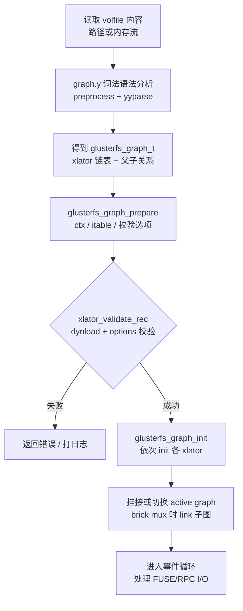

---

## 2. `libglusterfs`：单次 FOP 的 WIND / UNWIND

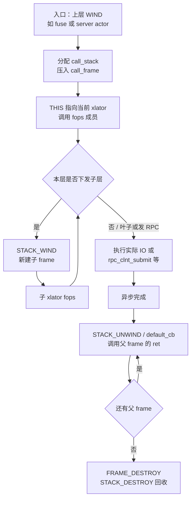

---

## 3. `libglusterfs`：典型 `lookup` 与 inode（概念）

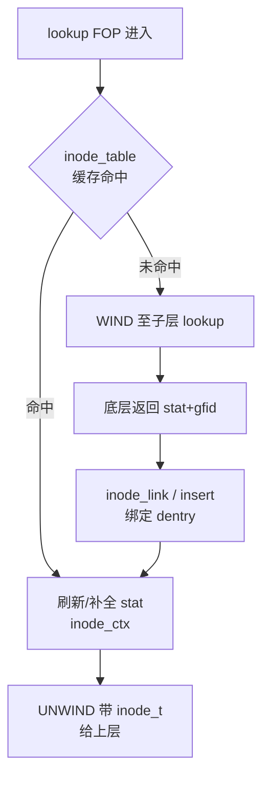

---

## 4. `libglusterfs`：事件循环与 I/O 就绪（概念）

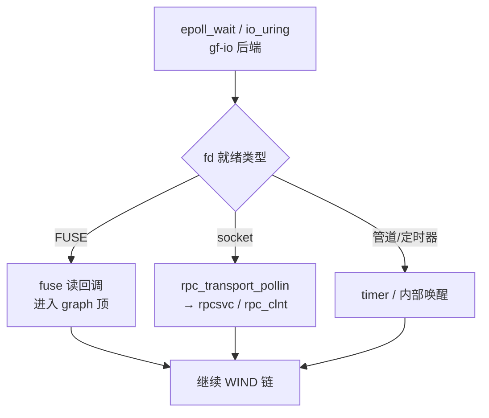

---

## 5. `rpc/xdr`：编解码在调用链中的位置

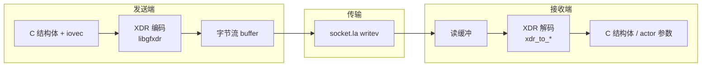

---

## 6. `rpc-lib`：服务端 `rpcsvc` 处理一帧 RPC

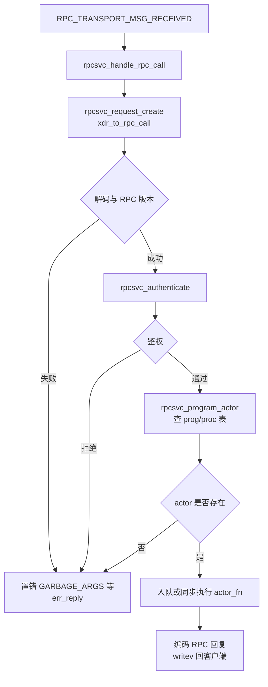

---

## 7. `rpc-lib`：客户端 `rpc_clnt` 发送与回调

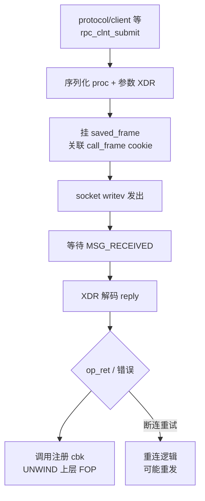

---

## 8. `rpc-transport/socket`：传输层事件

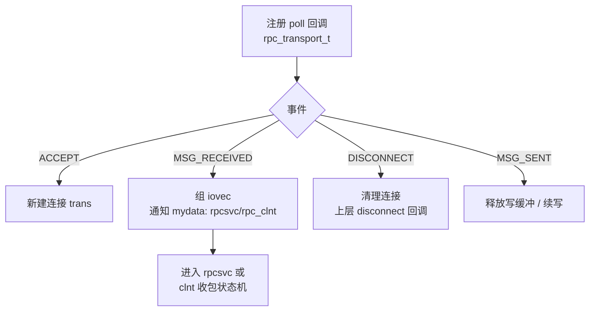

---

## 9. `glusterfsd`：进程启动主流程（概括）

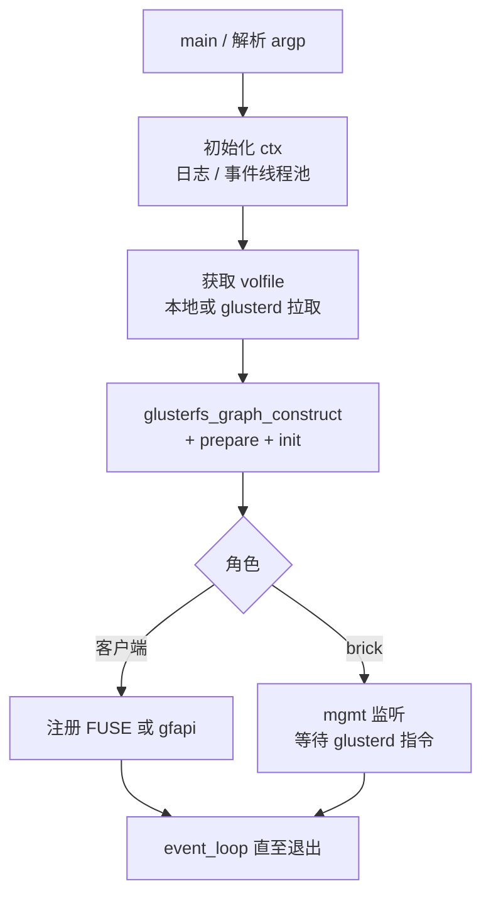

---

## 10. `cli`：命令行到 glusterd

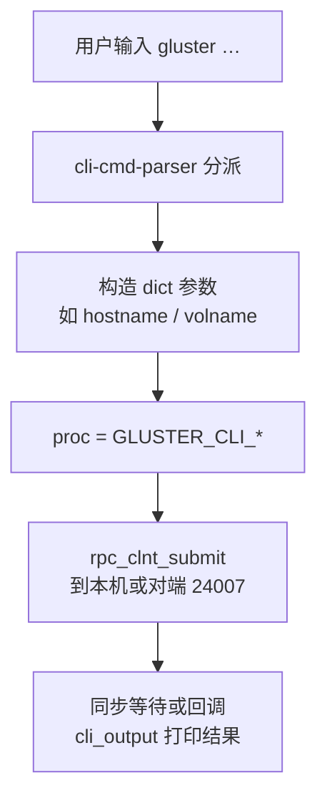

---

## 11. `xlators/mount/fuse`：内核读请求进入 graph

```mermaid
%%{init: {'flowchart': {'nodeSpacing': 20, 'rankSpacing': 36}, 'themeVariables': {'fontSize': '14px'}}}%%
flowchart TD
  F0[/dev/fuse 可读] --> F1[fuse 库回调<br/>如 fuse_read]
  F1 --> F2[查 inode / fd 绑定<br/>Gluster 侧对象]
  F2 --> F3[STACK_WIND readv<br/>子 xlator]
  F3 --> F4[异步返回后<br/>copy_to_user 等]
```

---

## 12. `xlators/protocol/client`：FOP → 网络 RPC

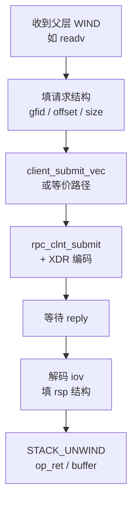

---

## 13. `xlators/protocol/server`：网络 RPC → FOP

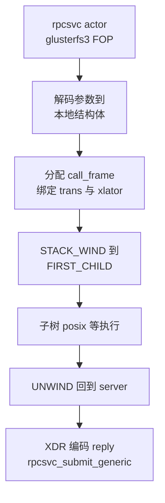

---

## 14. `xlators/cluster/dht`：`lookup` 选子卷（简化）

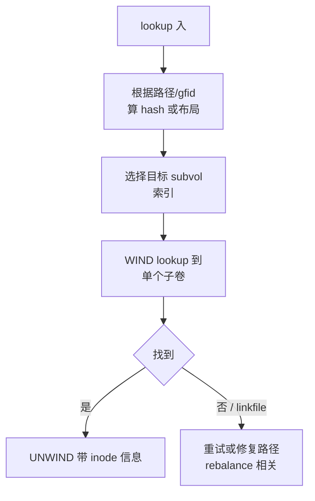

---

## 15. `xlators/cluster/afr`：读路径多副本（简化）

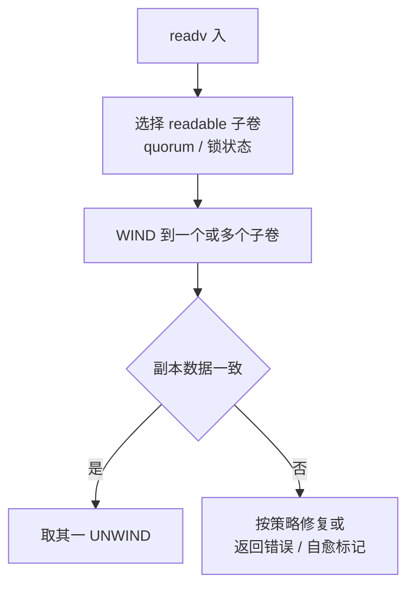

---

## 16. `xlators/cluster/ec`：条带读（简化）

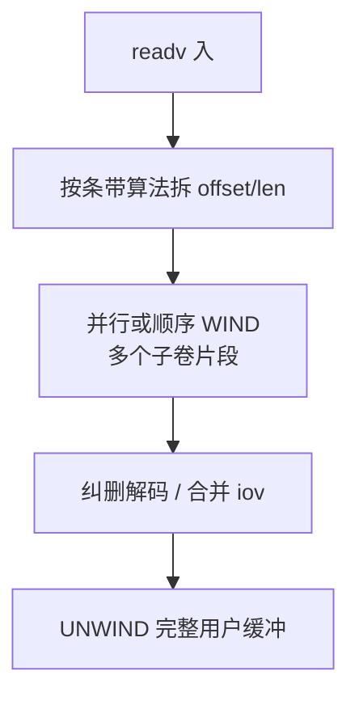

---

## 17. `xlators/storage/posix`：写落到本地文件系统

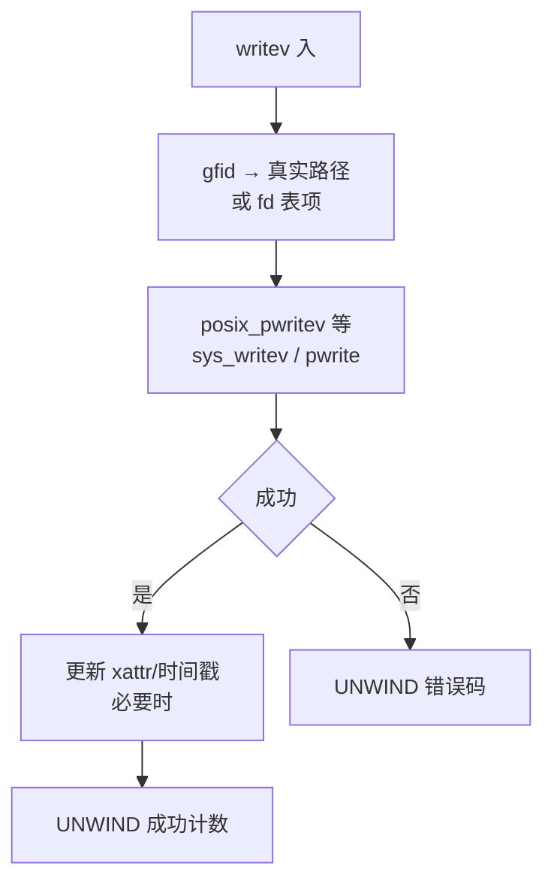

---

## 18. `xlators/performance/write-behind`：合并写（概念）

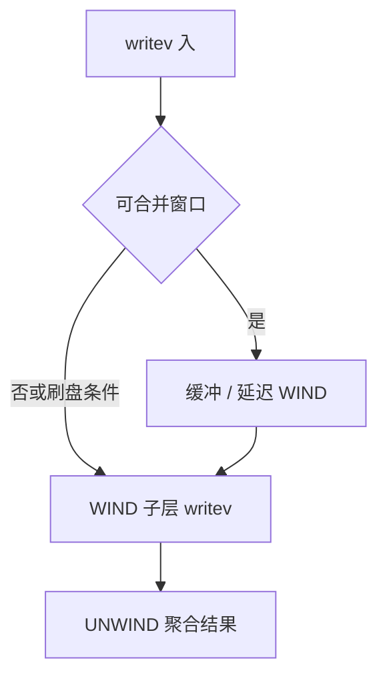

---

## 19. `xlators/mgmt/glusterd`：`peer probe` 双端（概括）

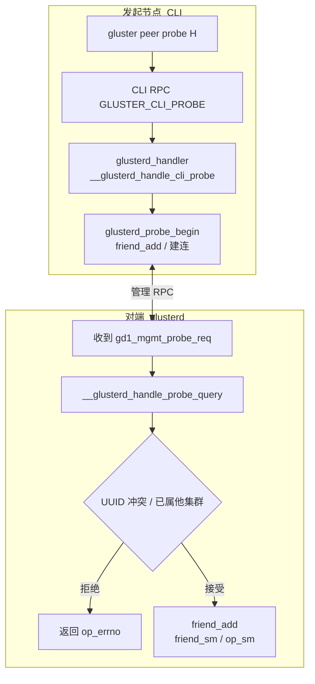

---

## 20. `xlators/mgmt/glusterd`：卷操作状态机（高度简化）

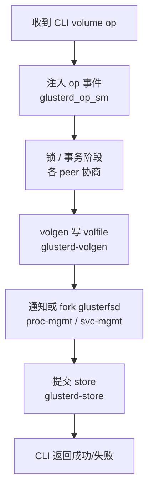

---

## 21. `api/libgfapi`：应用打开卷（概括）

```mermaid
%%{init: {'flowchart': {'nodeSpacing': 22, 'rankSpacing': 38}, 'themeVariables': {'fontSize': '14px'}}}%%
flowchart TD
  G0[glfs_new 分配 glfs_t] --> G1[解析 volname / 服务器]
  G1 --> G2[构造与挂载侧类似 graph<br/>api xlator + protocol/client]
  G2 --> G3[glfs_init 激活 graph]
  G3 --> G4[glfs_open / read<br/>走 FOP 与 client RPC]
```

---

## 22. `geo-replication`：主从同步（概念）

```mermaid
%%{init: {'flowchart': {'nodeSpacing': 20, 'rankSpacing': 36}, 'themeVariables': {'fontSize': '14px'}}}%%
flowchart TD
  G0[主卷 changelog 或<br/>rsync/变更流] --> G1[gsyncd / syncdaemon]
  G1 --> G2[解析变更记录]
  G2 --> G3[在从卷执行等价操作<br/>gfapi 或挂载]
  G3 --> G4[校验游标 / 断点续传]
```

---

## 23. `events/glustereventsd`：事件上报（概念）

```mermaid
%%{init: {'flowchart': {'nodeSpacing': 22, 'rankSpacing': 38}, 'themeVariables': {'fontSize': '14px'}}}%%
flowchart TD
  E0[Gluster 进程或钩子<br/>产生事件 JSON] --> E1[glustereventsd 接收<br/>HTTP/插件管道]
  E1 --> E2[handlers 路由]
  E2 --> E3[Webhook / 文件 / 自定义插件]
```

---

## 24. 端到端：客户端 `readv` 到 brick 再返回

```mermaid
%%{init: {'flowchart': {'nodeSpacing': 16, 'rankSpacing': 28}, 'themeVariables': {'fontSize': '13px'}}}%%
flowchart TB
  subgraph 客户端进程
    R1[FUSE read 回调] --> R2[performance 可选]
    R2 --> R3[cluster 选路]
    R3 --> R4[protocol/client<br/>RPC 编码]
  end
  R4 --> NET[TCP socket]
  NET --> R5[protocol/server<br/>actor]
  subgraph 存储节点进程
    R5 --> R6[cluster + features]
    R6 --> R7[posix pread]
  end
  R7 --> DISK[(brick 目录)]
  DISK --> R7
  R7 --> R6
  R6 --> R5
  R5 --> NET
  NET --> R4
  R4 --> R3
  R3 --> R2
  R2 --> R1
```

---

## 25. `tests/`：回归测试执行流（概括）

```mermaid
%%{init: {'flowchart': {'nodeSpacing': 22, 'rankSpacing': 38}, 'themeVariables': {'fontSize': '14px'}}}%%
flowchart TD
  T0[run-tests.sh / prove] --> T1[启动临时 glusterd<br/>构造卷]
  T1 --> T2[执行 .t 内命令<br/>bash + assert]
  T2 --> T3[比对输出与<br/>退出码]
  T3 --> T4[teardown 杀进程<br/>清目录]
```

---

### 使用说明

- 在 **VS Code / Cursor** 中安装 Markdown 预览增强或对 Mermaid 原生支持的预览即可渲染。  
- 图较多时若单页卡顿，可按章节拆分阅读。  
- 若某张图在旧版 Mermaid 中报错，可去掉行首的 `%%{init:…}%%` 再试。
